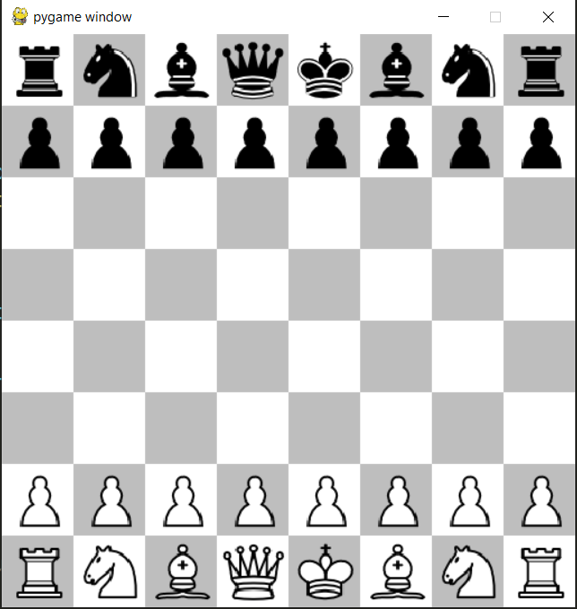

# Updated Version of an old Chess Implementation

One Paragraph of project description goes here

## Overview

A quick and dirty implementation of a chess engine using only pygame to display the board.


All chess rules are implemented.
No real title or endscreen, but replaybility is implemented (it's just not very pretty).


### Installing

Clone or download the repo install the requirements and run the main

```
>> pip install -r requirements.txt
>> python main.py
```


